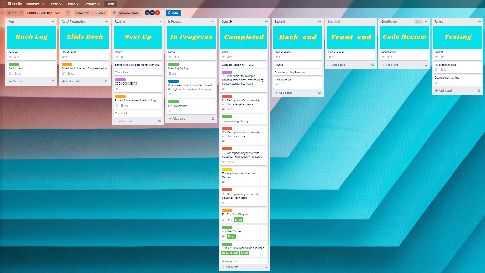
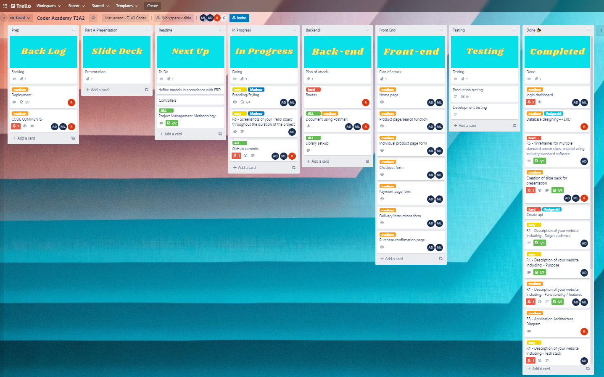
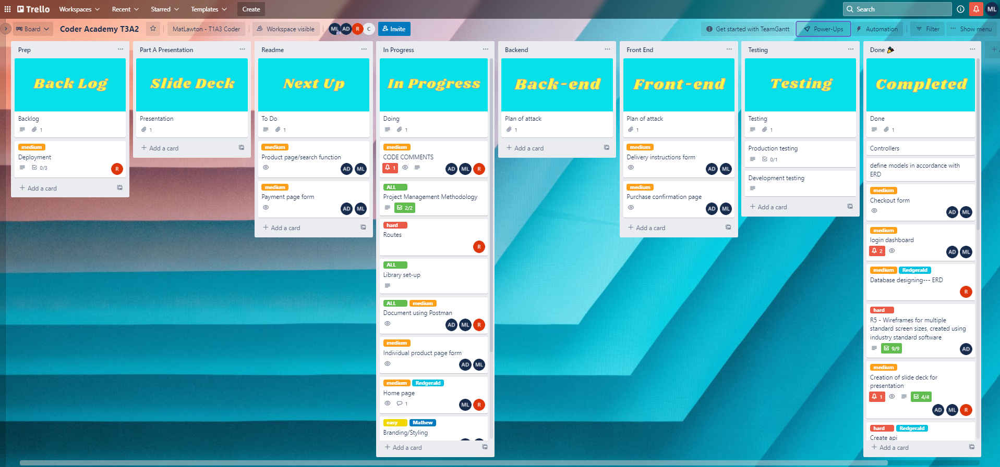
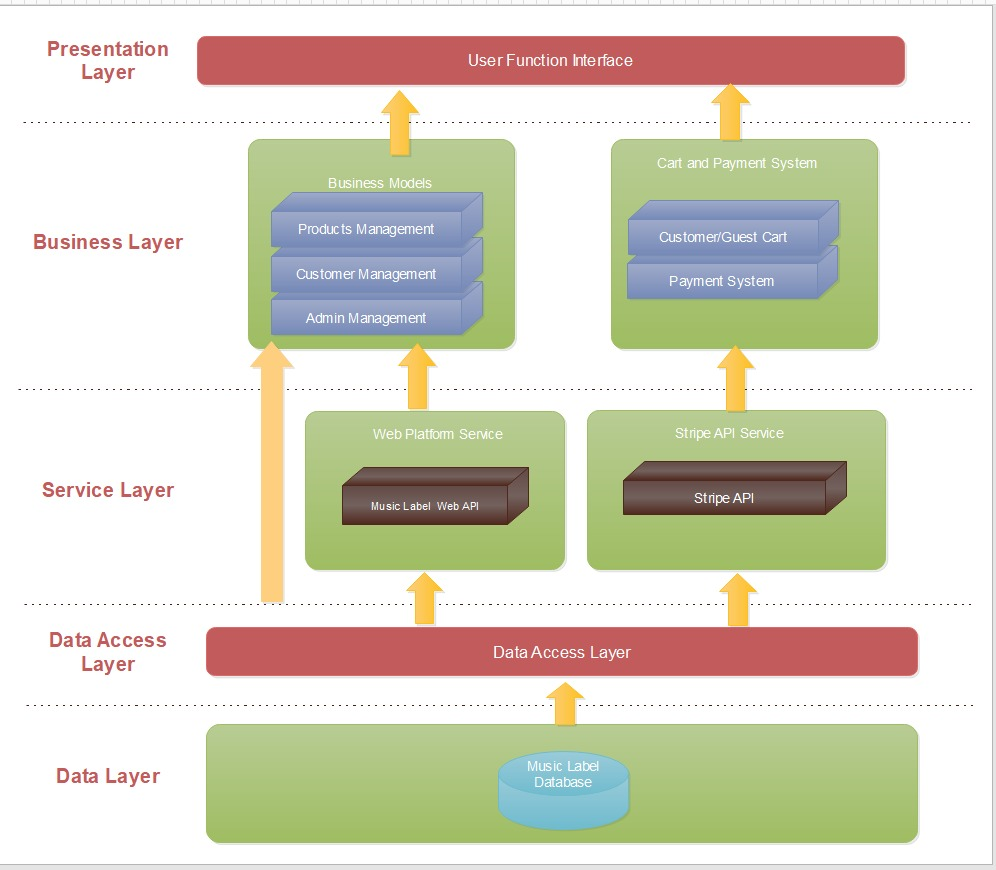
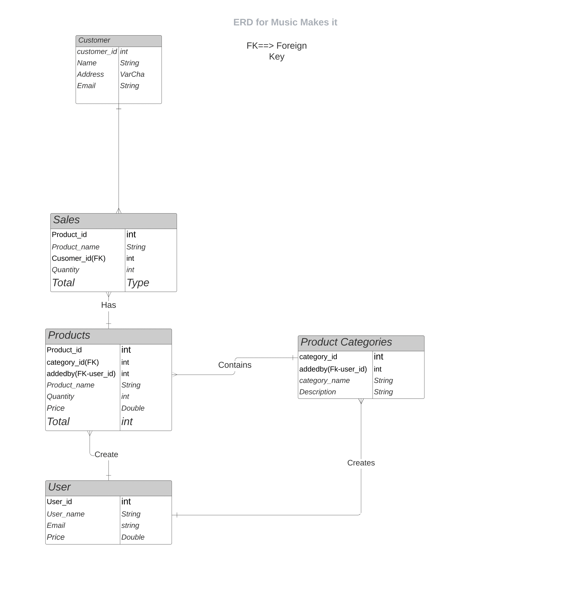
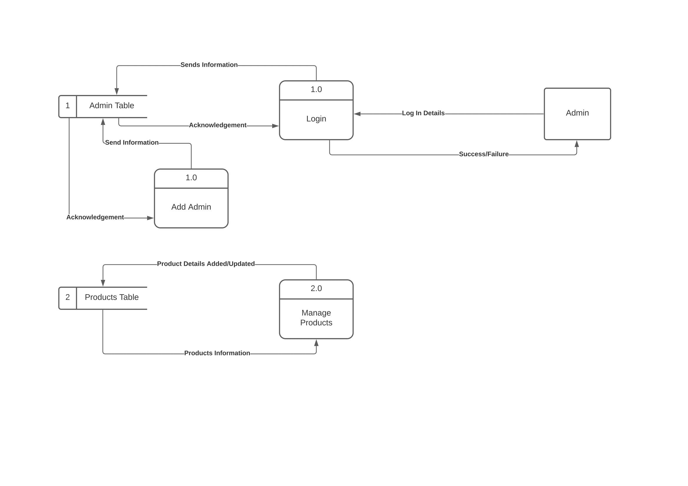
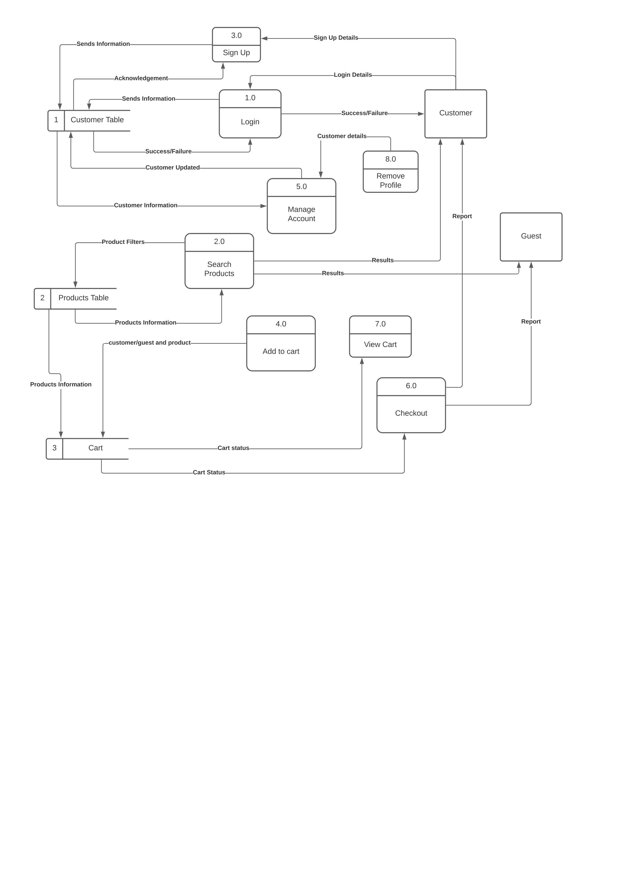
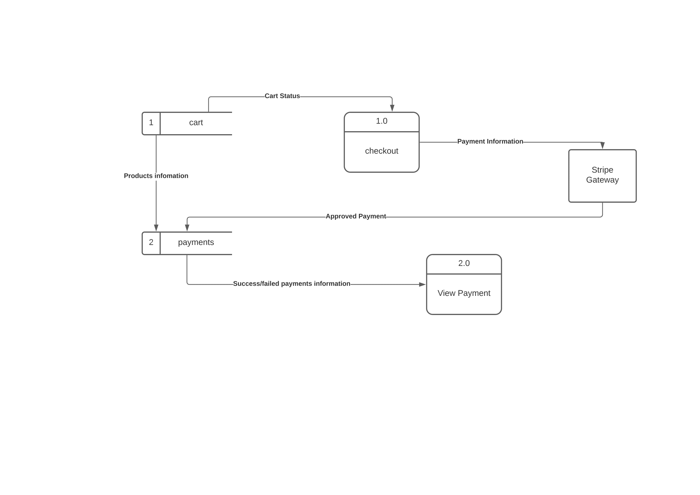

# :musical_note: Welcome to Music Makes It

A group project for Coder Academy - Full Stack App, Part A and Part B documentation.
You can find the authors of this organisation, repositories and project [here](https://github.com/Music-Makes-It/MMI-T3A2-Readme#authors).

Here is the link to our GitHub repo - [Click here.](https://github.com/Music-Makes-It/MMI-T3A2-Readme)

## About our project, What is Music Makes It?

**What is our purpose?**

_Music Makes it_, is an online store, where customers can safely search for and purchase music merchandise.
The purpose of _Music Makes It_, is to re-purpose the profits collected from merchandise.
Music artists have the potential to generate 10-35% of their revenue from merchandise sold at and during concerts. _Music Makes It_, is a side venture established by the team at _fake label name_ where they believe that these profits, should be put back in to the community.

The [Humpty Dumpty Foundation](https://humpty.com.au) mission is to ensure each child in the Australian hospital system have access to the correct equipment to support their treatment and recovery. For 30 years they have been providing this equipment to Pediatric Wards, Neonatal Units, Maternity and Emergency Departments in hospitals across Australia.

_Music Makes It_, is part of a growing sector of companies which include the community in their model. As consumers are increasingly becoming more aware of their product choices, their origins and affect on communities, it is important to respond to this change in our communities and assist in giving back. Our signed artists at _fake music label_ love being part of this initiative with our chosen organisation.

## What is our tech stack?

For our online store we decided to use the following tech stack to develop our project;

- Ruby On Rails
- React.js
- JavaScript (ES6)
- HTML5
- Bootstrap 5
- PostgreSQL

## Who is our target audience?

**Target Audience:**
The target audience of Music Makes it _fake music label_ are consumers of Music Merchandise, of the signed artists to the label.

**Range of Consumers and Online Store Users:**

- Those who would potentially shy away from purchasing merch at concerts.
- New customers to the online store.
- Individuals who would generally visit ebay, etsy, gumtree etc to purchase goods. The switch could be motivated by having an ethical alternative.
- Internet browser.
- Someone who has been referred.

**Target Audience Senarios**
Those who would potentially shy away from purchasing merch at concerts.

- Person X : Merch stand at the concert was crowded: I want to visit _Music Makes It_ online store, browse a large variety of products and make ethical purchase.
- Person X : Wants to purchase mum an offical t-shirt of favourite band : visits _Music Makes It_ online store- make ethical purchase
- Person X : Usually shops on ebay for their favourite band t-shirts but has heard there is an ethical alternative : visits _Music Makes It_ online store out of curiosity- make ethical purchase
- Person X : Wants a cost effective Christmas or Birthday gift that goes with a family members style.

## Project Management

Here is the link to our public Trello Board - [T3A2 Trello.](https://trello.com/b/A9VFk2sc/coder-academy-t3a2)

Day One - 20/01/2022

Day Two - 21/01/2022

Day Three - 25/01/2022

Day Four - 29/01/2022

Day Five **Part B** - 08/02/2022

Day Six **Part B** - 08/02/2022

## User Stories

The target audience of Music Makes it _fake music label_ are consumers of Music Merchandise, of the signed artists to the label. Throughout the planning stages of Music Makes it, the goal was to create a range focused online store that empowers users to give back. The features revolve around maximising user experience and as we developed these, the personas , need and purpose of the stories fit together.

**Range of Consumers and Online Store Users:**

- Those who would potentially shy away from purchasing merch at concerts.
- Individuals who would generally visit ebay, etsy, gumtree etc to purchase goods. The switch could be motivated by having an ethical alternative.
- Internet browser.
- Someone who has been referred.
- New customers to the online store.

**Target Audience Scenarios and Persona’s – through the features of the application.**
_Those that shy away from purchasing merch at concerts_

- I want to visits the online store and browse/search a large variety of products that are displayed cohesively.
- I want to make ethical an purchase.
- I want to take my time and have a quick and efficient sale.
- I want my personal details secure.
- I want my payment method to be from an approved merchant.
- I want to make an ethical purchase.
- I want to have the option to checkout as a guest.
- I want to see how many items I have in my cart.
- I want an order confirmation and order number.
- I want to have an option to sign up for music merchandise product releases.

**New customers to the online store, Internet browser, referred customer:**

- I want to know the purpose of the website.
- I want to navigation to flow, be clear and easy to use.
- I want to browse/search a large variety of products that are displayed cohesively.
- I want to make ethical an purchase.
- I want to take my time and have a quick and efficient sale.
- I want my personal details secure.
- I want my payment method to be from an approved merchant.
- I want to make an ethical purchase.
- I want to have the option to checkout as a guest.
- I want to see how many items I have in my cart.
- I want an order confirmation and order number.
- I want to have an option to sign up for music merchandise product releases.
- I want to select a custom delivery address.

**Individuals who would generally visit ebay, etsy, gumtree etc to purchase goods. The switch could be motivated by having an ethical alternative:**

- I want to purchase a product as gift, that also makes a difference in the community
- I want browse/search a large variety of products that are displayed cohesively.
- I want to make ethical an purchase.
- I want to take my time and have a quick and efficient sale.
- I want my personal details secure.
- I want my payment method to be from an approved merchant.
- I want to make an ethical purchase.
- I want to have the option to checkout as a guest.
- I want to see how many items I have in my cart.
- I want an order confirmation and order number.
- I want to have an option to sign up for music merchandise product releases.

**Verified Admin:**

- I want to add merchandise and details.
- I want to edit product details eg: sold out.
- I want feedback on my items sold.
- I want to code safely stored
- I want to be able to assess my code easily

**Authentication & Privacy:**

I want my personal information and data to be protected.
I want my dashboard to be private and not displayed publicly.
I want my purchases to be private and not shared.
I do not want other users to have access to editing or manipulating my posts/listings.
I do not want other users to see the items in my checkout cart.

## Third Party Apps/Services

Here are the third-party apps and services we will use to develop the 'Music Makes It', project.

- Devise. (Auth)
- Heroku. (Cloud, Back-End)
- Netlify. (Front-End)
- Trello
- Stripe
- Git
- GitHub
- Balsamiq(Wireframes)
- Bootstrap 5
- VS code
- DB Diagrams.io

## Application Architecture Diagram

## Entity Relationship Diagram (ERD)

## Dataflow Diagram

Admin Side Data Flow Diagram.

Customer Side Data Flow Diagram.

Payment Gateway Data Flow Diagram.

## Wireframes

Welcome to our landing page.

.png> "Wireframe of landing page")

This is our about us page.

.png> "Wireframe of about page")

This is our checkout page.

.png> "Wireframe of checkout page")

This is our Login page.

.png> "Wireframe of Login Page")

This is how our guests interact with out site.

.png> "Wireframe of Login guest page")

This is our delivery page.

.png> "Wireframe of delivery page")

This is our items page.

.png> "Wireframe of Item page")

This is our payment page.

.png> "Wireframe of payment page")

This is our receipt page.

.png> "Wireframe of receipt page")

This is our wear it page.

.png> "Wireframe of wear it page")

## Roadmap

Our roadmap for the future of updates and versions to come is ...
v1.0.1 that will be everything we as a team we're not able to execute within our given timeframe for our first submmison of Part A ...

## Want to join the repo and contribute?

**Contributing to 'Music Makes It', is as easy as**
Contributions are not only welcome but are what make the open source community a great and wonderful place to learn, share, create and inspire. Any and all contributions you make are kindly appreciated.

1. Fork the Project.
2. Create a Feature Branch (`git checkout -b YourBranchName`)
3. Commit your Changes (`git commit -m 'Add a feature/amendment'`)
4. Push to the newly created Branch (`git push origin YourBranchName`)
5. Open a Pull Request.

## Authors

Amy Droungas - Organising documentation. [Github]

Redgerald Nyamadzavo - Back-End development, Diagram specialist and Databasing. [Github]

Mathew Lawton - Organising documentation, Front-End development, Back-End Development assistant, Wireframing and Architecture design. [Github](https://github.com/matlawton)

## Acknowledgements

We would like to thank the team at [Coder Academy](https://www.coderacademy.edu.au/) for their support.
